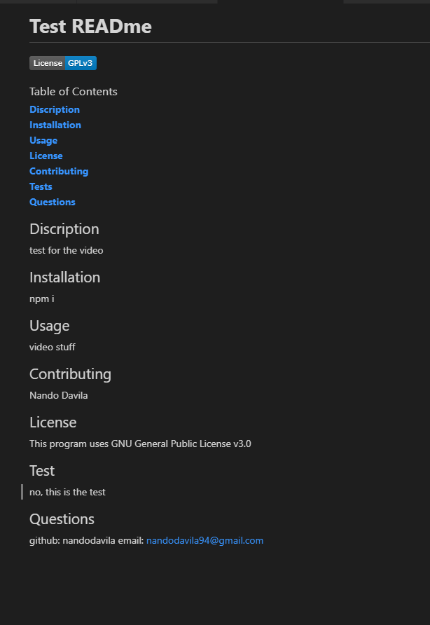

  # **READme Generator**

   

  ### Table of Contents
  **[Discription](#discription)** 
   
  **[Usage](#usage)** 
  **[License](#license)** 
  **[Contributing](#contributing)** 
  **[Tests](#tests)** 
  **[Questions](#Questions)** 
  

  ## Discription 

  This app will make making READme.MDs easier, and quicker. It will ask you basic question about you application, and fill in your read me when you are done

  ## Installation
  npm i

  ## Usage

  Just type node index in your console and let it do the rest

  ## Contributing

  Fernando Davila

   

  ## Test
 
  

  ## Questions
  github: nandodavila
  email: nandodavila94@gmail.com

  ## Example
  

  
